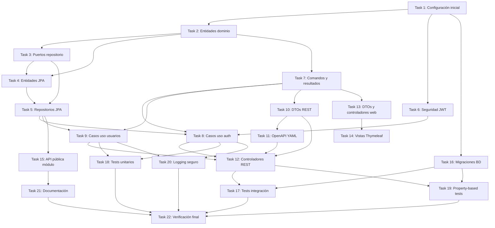

# Implementation Plan: User Management Module

## Overview

Este plan de implementación detalla las 22 tareas necesarias para construir el módulo `user-management` de Vacapp siguiendo la arquitectura Spring Modulith + Clean Architecture. El módulo proporciona autenticación JWT, autorización basada en roles, gestión multi-tenant de usuarios, y una interfaz dual (API REST + Web Thymeleaf).

Las tareas están organizadas en un grafo de dependencias que permite ejecutar tareas en paralelo cuando no tienen dependencias entre sí, optimizando el tiempo de desarrollo.

## Tasks

- [ ] 1. Configuración inicial del proyecto y dependencias Maven
  - [ ] 1.1. Actualizar pom.xml con dependencias Spring Boot 4.1.0, Spring Modulith, Spring Security, JWT (jjwt), BCrypt, Lombok, Bean Validation
  - [ ] 1.2. Configurar application.yml con propiedades de base de datos MySQL, JWT secret, logging
  - [ ] 1.3. Crear estructura de paquetes siguiendo arquitectura Spring Modulith: mx.vacapp.users/ con subdirectorios internal/
  - [ ] 1.4. Configurar plugin openapi-generator-maven-plugin para generación de interfaces desde YAML

- [ ] 2. Crear entidades de dominio puras (domain layer)
  - [ ] 2.1. Crear enum Role.java con 6 roles (super_admin, support, admin, manager, veterinarian, worker)
  - [ ] 2.2. Crear enum UserStatus.java (ACTIVE, INACTIVE, LOCKED)
  - [ ] 2.3. Crear clase User.java como entidad de dominio inmutable con Builder pattern
  - [ ] 2.4. Implementar métodos de negocio en User: isActive(), isSaaSUser(), hasSaaSRole(), deactivate(), changeRole()
  - [ ] 2.5. Crear excepciones de dominio: InvalidCredentialsException, UserAlreadyExistsException, UserNotFoundException, AccountLockedException, InactiveAccountException

- [ ] 3. Crear puertos de salida (repository interfaces)
  - [ ] 3.1. Crear interfaz UserRepository.java con métodos: save, findById, findByEmail, existsByEmailAndTenantId, findAll, count, deactivate
  - [ ] 3.2. Crear interfaz AuditRepository.java con métodos: logAuthentication, logUserCreation, logUserUpdate, logUserDeactivation

- [ ] 4. Crear entidades JPA y mappers
  - [ ] 4.1. Crear UserEntity.java con anotaciones JPA (@Entity, @Table("users"), @Id, @Column)
  - [ ] 4.2. Crear UserAuditEntity.java para tabla users_audit
  - [ ] 4.3. Crear AuthLogEntity.java para tabla authentication_log
  - [ ] 4.4. Crear UserMapper.java para mapear User ↔ UserEntity con métodos toEntity() y toDomain()
  - [ ] 4.5. Crear AuditMapper.java para mapeo de auditoría

- [ ] 5. Implementar repositorios JPA
  - [ ] 5.1. Crear UserJpaRepository extends JpaRepository<UserEntity, UUID>
  - [ ] 5.2. Crear UserAuditJpaRepository extends JpaRepository<UserAuditEntity, UUID>
  - [ ] 5.3. Crear AuthLogJpaRepository extends JpaRepository<AuthLogEntity, UUID>
  - [ ] 5.4. Crear UserRepositoryImpl implements UserRepository con filtrado automático por tenant_id usando TenantContext
  - [ ] 5.5. Crear AuditRepositoryImpl implements AuditRepository

- [ ] 6. Implementar configuración de seguridad JWT
  - [ ] 6.1. Crear JwtTokenProvider.java con métodos: generateToken(), validateToken(), extractClaims(), extractUserId(), extractTenantId(), extractRoles()
  - [ ] 6.2. Crear JwtAuthenticationFilter extends OncePerRequestFilter para interceptar requests y validar JWT
  - [ ] 6.3. Crear TenantContext.java con ThreadLocal para almacenar tenant_id actual
  - [ ] 6.4. Crear SecurityConfig.java con configuración Spring Security 6 (SecurityFilterChain, rutas públicas/protegidas, CORS)
  - [ ] 6.5. Crear PasswordEncoderConfig.java con bean BCryptPasswordEncoder(strength 12)

- [ ] 7. Crear comandos y resultados (application layer)
  - [ ] 7.1. Crear LoginCommand.java con campos: email, password, clientIp, userAgent
  - [ ] 7.2. Crear AuthResult.java con campos: token, userId, email, name, role, tenantId
  - [ ] 7.3. Crear CreateUserCommand.java con campos: email, name, phone, password, role, tenantId, createdBy
  - [ ] 7.4. Crear UpdateUserCommand.java con campos: userId, name, phone, role, updatedBy
  - [ ] 7.5. Crear UserResult.java con método estático fromDomain(User user)

- [ ] 8. Implementar casos de uso de autenticación
  - [ ] 8.1. Crear LoginUseCase.java con lógica: buscar usuario, validar contraseña, verificar estado, generar JWT, registrar auditoría
  - [ ] 8.2. Crear ValidateTokenUseCase.java para validar JWT y extraer información del usuario
  - [ ] 8.3. Implementar lógica de rate limiting (5 intentos por minuto por IP)
  - [ ] 8.4. Implementar lógica de bloqueo de cuenta (5 intentos fallidos en 15 min → LOCKED)

- [ ] 9. Implementar casos de uso de gestión de usuarios
  - [ ] 9.1. Crear CreateUserUseCase.java con validación de email único, cifrado de contraseña, asignación de rol por defecto (WORKER)
  - [ ] 9.2. Crear UpdateUserUseCase.java con validación de permisos y prohibición de cambio de tenant_id
  - [ ] 9.3. Crear GetUserUseCase.java para obtener usuario por ID
  - [ ] 9.4. Crear ListUsersUseCase.java con paginación (máximo 50 por página)
  - [ ] 9.5. Crear DeactivateUserUseCase.java para marcar usuario como INACTIVE
  - [ ] 9.6. Crear ChangeUserRoleUseCase.java con validación de permisos según rol del usuario autenticado

- [ ] 10. Crear DTOs para API REST móvil
  - [ ] 10.1. Crear LoginRequest.java con validaciones @NotNull, @Email, @Size
  - [ ] 10.2. Crear LoginResponse.java
  - [ ] 10.3. Crear CreateUserRequest.java con validaciones Bean Validation completas
  - [ ] 10.4. Crear UpdateUserRequest.java
  - [ ] 10.5. Crear UserResponse.java (sin campo password)
  - [ ] 10.6. Crear ErrorResponse.java con estructura: errors array con field + message
  - [ ] 10.7. Crear PaginationMetadata.java con campos: page, size, total

- [ ] 11. Crear especificación OpenAPI YAML
  - [ ] 11.1. Crear archivo src/main/resources/openapi/openapi-users.yaml
  - [ ] 11.2. Definir schemas para LoginRequest, LoginResponse, CreateUserRequest, UpdateUserRequest, UserResponse, ErrorResponse
  - [ ] 11.3. Definir endpoints: POST /api/v1/auth/login, GET /api/v1/users, GET /api/v1/users/{id}, POST /api/v1/users, PUT /api/v1/users/{id}, DELETE /api/v1/users/{id}
  - [ ] 11.4. Especificar códigos HTTP por endpoint: 200, 201, 400, 401, 403, 404, 409
  - [ ] 11.5. Configurar securitySchemes con Bearer JWT

- [ ] 12. Implementar controladores REST para móvil
  - [ ] 12.1. Crear AuthRestController.java implements AuthApi con método login()
  - [ ] 12.2. Crear UserRestController.java implements UsersApi con métodos CRUD
  - [ ] 12.3. Implementar mapeo de DTOs Request → Commands en controladores
  - [ ] 12.4. Implementar mapeo de Results → DTOs Response en controladores
  - [ ] 12.5. Implementar @ExceptionHandler para mapear excepciones de dominio a códigos HTTP apropiados
  - [ ] 12.6. Extraer clientIp y userAgent de HttpServletRequest en login

- [ ] 13. Crear DTOs y controladores web (Thymeleaf)
  - [ ] 13.1. Crear LoginFormDto.java para formulario de login
  - [ ] 13.2. Crear UserFormDto.java para formularios de crear/editar usuario
  - [ ] 13.3. Crear AuthWebController.java con métodos: showLoginPage(), showDashboard()
  - [ ] 13.4. Crear UserWebController.java con métodos: listUsers(), showCreateForm(), showEditForm()

- [ ] 14. Crear vistas Thymeleaf y assets CSS
  - [ ] 14.1. Crear templates/auth/login.html con formulario de login y JavaScript vanilla para POST /api/v1/auth/login
  - [ ] 14.2. Crear templates/dashboard/index.html
  - [ ] 14.3. Crear templates/admin/usuarios.html con tabla de usuarios y formulario modal para crear/editar
  - [ ] 14.4. Crear templates/fragments/navbar.html con logo, usuario actual, botón logout
  - [ ] 14.5. Crear templates/fragments/sidebar.html con links a dashboard y admin
  - [ ] 14.6. Crear static/css/global.css con variables CSS y reset
  - [ ] 14.7. Crear static/css/login.css, static/css/dashboard.css, static/css/navbar.css, static/css/sidebar.css

- [ ] 15. Implementar API pública del módulo (UsersService)
  - [ ] 15.1. Crear interfaz UsersService.java en raíz del paquete mx.vacapp.users/
  - [ ] 15.2. Implementar UsersServiceImpl.java con métodos: isUserActive(UUID), getUserTenantId(UUID), hasRole(UUID, String)
  - [ ] 15.3. Registrar bean UsersService en UsersModuleConfig.java

- [ ] 16. Crear scripts de migración de base de datos
  - [ ] 16.1. Crear script V1__create_users_table.sql con tabla users (user_id UUID PK, email VARCHAR(255), name VARCHAR(100), phone VARCHAR(20), password_hash VARCHAR(255), role ENUM, status ENUM, tenant_id UUID nullable, created_at TIMESTAMP, updated_at TIMESTAMP, created_by UUID, updated_by UUID)
  - [ ] 16.2. Crear índice único en (email, tenant_id) para validar unicidad por tenant
  - [ ] 16.3. Crear script V2__create_users_audit_table.sql
  - [ ] 16.4. Crear script V3__create_authentication_log_table.sql
  - [ ] 16.5. Crear índices para queries comunes: tenant_id, email, created_at

- [ ] 17. Implementar tests de integración para API REST
  - [ ] 17.1. Configurar TestContainers con MySQL para tests de integración
  - [ ] 17.2. Crear AuthRestControllerIntegrationTest.java con tests para POST /auth/login (success, invalid credentials, inactive account, locked account)
  - [ ] 17.3. Crear UserRestControllerIntegrationTest.java con tests CRUD completos
  - [ ] 17.4. Verificar códigos HTTP correctos para cada escenario
  - [ ] 17.5. Verificar filtrado multi-tenant en tests (usuario de tenant A no puede ver datos de tenant B)
  - [ ] 17.6. Verificar rate limiting y bloqueo de cuenta en tests

- [ ] 18. Implementar tests unitarios de casos de uso
  - [ ] 18.1. Crear LoginUseCaseTest.java con mocks de UserRepository, AuditRepository, PasswordEncoder, JwtTokenProvider
  - [ ] 18.2. Crear CreateUserUseCaseTest.java con tests de validación de email único, cifrado de contraseña
  - [ ] 18.3. Crear UpdateUserUseCaseTest.java
  - [ ] 18.4. Crear DeactivateUserUseCaseTest.java
  - [ ] 18.5. Verificar que todos los casos de error lanzan excepción correcta

- [ ] 19. Implementar property-based tests con jqwik
  - [ ] 19.1. Añadir dependencia jqwik al pom.xml
  - [ ] 19.2. Crear JwtTokenPropertiesTest.java para validar Property 1: Round-trip JWT Token Validation
  - [ ] 19.3. Crear EmailUniquenessPropertiesTest.java para validar Property 2: Email Uniqueness Within Tenant
  - [ ] 19.4. Crear PasswordComplexityPropertiesTest.java para validar Property 3: Password Complexity Enforcement
  - [ ] 19.5. Crear MultiTenancyIsolationPropertiesTest.java para validar Property 4: Multi-tenancy Isolation
  - [ ] 19.6. Crear JwtExpirationPropertiesTest.java para validar Property 5: JWT Expiration Consistency
  - [ ] 19.7. Crear RoleAuthorizationPropertiesTest.java para validar Property 6: Role-Based Authorization Hierarchy
  - [ ] 19.8. Crear AuditTrailPropertiesTest.java para validar Property 7: Audit Trail Completeness
  - [ ] 19.9. Crear EmailFormatPropertiesTest.java para validar Property 8: Email Format Validation
  - [ ] 19.10. Crear RoleBehaviorPropertiesTest.java para validar Property 9: SaaS vs Business Role Behavior
  - [ ] 19.11. Crear PasswordRedactionPropertiesTest.java para validar Property 10: Password Redaction in Logs

- [ ] 20. Configurar logging y sanitización de datos sensibles
  - [ ] 20.1. Configurar logback-spring.xml con pattern que redacta campos password/secret
  - [ ] 20.2. Crear SensitiveDataFilter.java para interceptar logs y reemplazar valores sensibles con [REDACTED]
  - [ ] 20.3. Configurar logging levels por paquete en application.yml
  - [ ] 20.4. Implementar @Slf4j en clases clave para logging estructurado

- [ ] 21. Documentar módulo y generar JavaDoc
  - [ ] 21.1. Añadir JavaDoc a UsersService.java
  - [ ] 21.2. Añadir JavaDoc a todas las interfaces públicas de dominio
  - [ ] 21.3. Crear README.md del módulo con arquitectura, endpoints, ejemplos de uso
  - [ ] 21.4. Generar JavaDoc con `mvn javadoc:javadoc`
  - [ ] 21.5. Crear diagrama de arquitectura (opcional)

- [ ] 22. Verificación final y smoke tests
  - [ ] 22.1. Ejecutar `mvn clean install` sin errores
  - [ ] 22.2. Iniciar aplicación con `mvn spring-boot:run`
  - [ ] 22.3. Verificar Swagger UI accesible en http://localhost:8080/swagger-ui/index.html
  - [ ] 22.4. Probar login vía Swagger UI con usuario de prueba
  - [ ] 22.5. Verificar interfaz web accesible en http://localhost:8080/auth/login
  - [ ] 22.6. Ejecutar todos los tests con `mvn test` y verificar > 80% coverage
  - [ ] 22.7. Verificar logs no contienen datos sensibles

## Task Dependency Graph

```json
{
  "waves": [
    {
      "name": "Setup",
      "tasks": [1]
    },
    {
      "name": "Foundation",
      "tasks": [2, 6, 16]
    },
    {
      "name": "Ports and Adapters",
      "tasks": [3, 4]
    },
    {
      "name": "Persistence",
      "tasks": [5]
    },
    {
      "name": "Application Layer",
      "tasks": [7]
    },
    {
      "name": "Use Cases",
      "tasks": [8, 9]
    },
    {
      "name": "API Contracts",
      "tasks": [10, 11, 13]
    },
    {
      "name": "Controllers",
      "tasks": [12, 14, 15]
    },
    {
      "name": "Testing",
      "tasks": [17, 18]
    },
    {
      "name": "Advanced Testing",
      "tasks": [19, 20]
    },
    {
      "name": "Documentation",
      "tasks": [21]
    },
    {
      "name": "Verification",
      "tasks": [22]
    }
  ]
}
```



## Notes

- **Paralelización**: Las tareas 2, 6 y 16 pueden ejecutarse en paralelo después de la tarea 1
- **Testing temprano**: Los tests de integración (17) y unitarios (18) deben ejecutarse tan pronto como los componentes correspondientes estén disponibles
- **Property-based tests**: La tarea 19 es crítica para validar las 10 propiedades de correctitud definidas en design.md
- **Multi-tenancy**: El filtrado por tenant_id debe verificarse exhaustivamente en las tareas 5, 17 y 19
- **Seguridad**: La sanitización de logs (tarea 20) debe implementarse antes de la verificación final
- **OpenAPI Design-First**: La tarea 11 define el contrato que guía la implementación de la tarea 12
- **Dependencias Maven**: Verificar que todas las dependencias estén en pom.xml antes de proceder con las tareas de implementación
